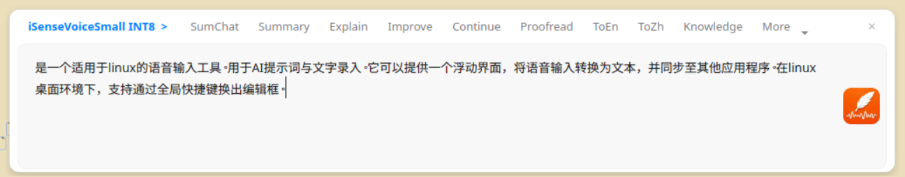

# VoxQuill

**A Linux-based desktop utility for voice-to-text input, specialized for AI prompting workflows.**

**Author**: Lancelot MEI  
[English](./README.md) | [中文版](./README_zh.md)

> [!IMPORTANT]
> **Development Status and Platform Restrictions**:
>
> - Currently **only tested on Ubuntu + Wayland** environments.
> - This program is a **development tool for private/guest use**. It has not undergone extensive cross-distribution and cross-protocol (X11) testing.
> - The transcription accuracy is currently lower than some commercial offline modes (e.g., iFlytek).
> - The punctuation logic is rudimentary and may result in redundant periods.

---



## Core Features (Objectives)

VoxQuill provides a floating interface to capture voice input and sync the transcribed text into other application windows.

- **Global Hotkey Trigger**: Summon a floating text edit box across different Linux desktop environments using shortcuts.
- **Voice-to-Text with Manual Refinement**:
  - Auto-Recording: Features built-in Voice Activity Detection (VAD) to start recording immediately upon being summoned. Supports `sensevoice small` (multilingual: ZH, EN, JA, KO).
  - Manual Editing: Transcription results are displayed in the input box for manual refinement before pasting.
- **Automated Text Injection**:
  - **Submit Shortcut (`Ctrl+Enter`)**: Copies the current editor contents to the clipboard, returns focus to the previously active window, and attempts to paste there automatically.
  - **Direct Input Shortcut (`Ctrl+Shift+Enter`)**: Copies the current editor contents to the clipboard, returns focus to the previous window, and tries to type the text as real keystrokes. This path is better suited for terminals and other targets where `Ctrl+V` paste is unreliable.
  - **X11 Environment**: Automatic paste falls back to `pynput`. Note: X11 support is theoretical and has not been formally tested.
  - **Wayland Environment**: Automatic paste tries the XDG Desktop Portal RemoteDesktop path first, then falls back to `wtype` or `evdev/uinput` only if portal injection is unavailable or denied. The direct-input path prefers `wtype` first and falls back to `pynput` if needed.
  - **Recording Shortcut (`Esc`)**: Toggles recording on and off without submitting text.
- **AI Prompt Workflow**:
  - Predefined Templates: Quickly insert preset prompt texts via the UI.
  - In-place Expansion: Detects specific command prefixes (e.g., `//s`) and expands them into full prompt templates automatically.

---

## Running the Program

Ensure you have completed the [Installation Guide](#installation-guide) first.

1. **Activate Virtual Environment**:

    ```bash
    source .venv/bin/activate
    ```

2. **Start the Main Process**:

    ```bash
    python3 main.py
    ```

   By default on Wayland, VoxQuill now prefers native Wayland Qt mode so focus handoff and portal paste stay in the same windowing model.
   If you need the older XWayland compatibility mode for troubleshooting, start it with:

    ```bash
    VOXQUILL_FORCE_XCB=1 python3 main.py
    ```

3. **Configure Global Hotkey (Recommended)**:
    Map a global shortcut in your Desktop Environment to the following command:

    ```bash
    # Use the **absolute path** to your venv python and cli.py
    /path/to/VoxQuill/.venv/bin/python /path/to/VoxQuill/cli.py --command toggle
    ```

---

## Interaction Semantics

The app currently revolves around four main states:

- **Hidden**: The floating window is not visible, while the tray icon and IPC endpoint stay available.
- **VisibleIdle**: The floating window is visible and editable, but not recording.
- **VisibleRecording**: The floating window is visible and actively capturing speech.
- **Submitting**: A submit action is in progress, including stop-recording cleanup, clipboard sync, hide/focus handoff, paste/type attempt, and text cleanup.

The current shortcut semantics are:

- **`Esc`**: Only toggles recording on and off.
- **`Ctrl+Enter` / `Ctrl+Return`**: Submit current text through the clipboard-and-paste path. If recording is active, the app stops recording first and only then continues submission.
- **`Ctrl+Shift+Enter` / `Ctrl+Shift+Return`**: Submit current text through the direct-typing path, intended for targets where paste is unstable.
- **Global hotkey bound to `cli.py --command toggle`**: Toggles recording state rather than window visibility. It appears to "summon and record" because recording start also brings the window to the front.
- **Close button `×`, tray Hide, or IPC `hide`**: Hide the floating window without quitting the process.

The minimum success guarantee remains: the submitted text is already in the system clipboard. Paste/type automation is an enhancement layer; if desktop restrictions block it, manual completion is still possible.

---

## Configuration

Custom behaviors are managed via JSON files in the `config/` directory:

- **`config/models.json`**:
  - Management of ASR model paths and pipeline parameters.
  - History directory configuration (`history_dir`).
  - History toggle (`history_enabled`).
- **`config/prompts.json`**:
  - Definition of AI prompt templates.
  - Command prefix mappings (e.g., mapping `//s` to a complex system role).
- **`config/shortcuts.json`**:
  - Default and user-editable UI shortcut bindings.
  - Shortcut handlers now route through named actions, so future UI-based shortcut editing can reuse the same action registry.
- **`config/ui.json`**:
  - Stores appearance preferences for the floating window.
  - Current keys:
    - `theme`: `light` or `dark`
    - `inactive_opacity`: opacity used when the window is visible but intentionally not focused

---

## Submit Shortcuts, Focus Return, and History

The app now supports two submit modes. Both copy the current text into the system clipboard first:

- **`Ctrl+Enter`**: submit by paste
- **`Ctrl+Shift+Enter`**: submit by direct typing

Pressing either shortcut triggers the following sequence:

1. **Stop Recording**: If recording is active, the app stops capture first and freezes the final text.
2. **Clipboard Sync**: Copies the current text buffer to the system clipboard.
3. **Return Focus**: The floating editor yields focus back to the previously active application window.
4. **Local Archiving (History Logging)**:
    - Text is automatically appended to a history file.
    - Default directory: `~/Documents/VoxQuill/History` (Adjustable in `models.json`).
    - File format: Monthly Markdown files (e.g., `2026-03vox.md`).
    - Entry format: ISO timestamps and daily headings to record every entry.
5. **Submit Execution**:
   - Paste mode attempts an automatic paste into the target window.
   - Direct-input mode attempts keystroke-level text injection into the target window.
   - On GNOME/Wayland, paste mode first attempts the XDG Desktop Portal RemoteDesktop path and reuses/restores sessions when possible.
   - If automation fails after fallback attempts, the app shows a confirmation dialog and keeps the text in the clipboard for manual completion.
6. **Clear Input**: Clears the floating editor after a non-empty submit.

The **Esc** key no longer submits text. It now only toggles recording on and off.

## Appearance Preferences

Appearance settings are now persisted and applied across launches:

1. Open **Model Manager (`Ctrl+M`)**.
2. Choose **Light** or **Dark** theme.
3. Adjust **Inactive opacity** to control how visible the floating window remains after submission while it is shown without focus.
4. Click **Save & Apply** to persist the change into `config/ui.json` and immediately refresh the app stylesheet.

This makes the "return focus but keep the box visible" behavior configurable instead of hard-coded.

---

## Technical Stack

- **UI Framework**: PyQt6
- **ASR Engine**: Powered by [sherpa-onnx](https://github.com/k2-fsa/sherpa-onnx) (Runs locally/offline)
- **Voice Activity Detection**: Silero VAD v5 (ONNX Runtime)
- **Inter-Process Communication (IPC)**: JSON-based Unix Domain Sockets
- **Audio I/O**: PyAudio
- **Platform Support**: Tested only on Ubuntu + Wayland.

---

## Installation Guide

### 1. System Dependencies

Requires `libxcb-cursor0` for correct window positioning and interaction on Wayland.

### 2. Environment Setup

```bash
git clone https://github.com/lancelotmei/VoxQuill.git
cd VoxQuill
python3 -m venv .venv
source .venv/bin/activate
pip install -r requirements.txt
```

### 3. Model Acquisition

Download models via the **Model Manager (Ctrl+M)** in the UI or run the script:

```bash
python3 scripts/download_models.py
```

---

## Known Issues

- **Paste Limitation (Wayland)**: Due to protocol security, auto-paste may behave differently across compositors (GNOME/KDE/Sway). If it fails, use manual paste.
- **Window Positioning**: Currently unable to accurately track and follow the active cursor position.

---

## Build & Packaging

If you need a standalone Linux executable, run:

```bash
./scripts/build_linux.sh
```

---

## License

**GNU GPL v3.0**
